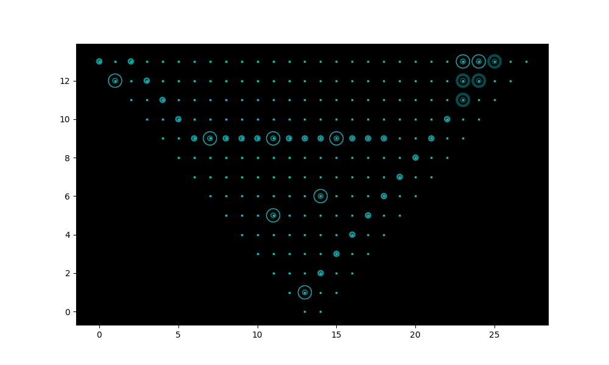

# my v0.1 algo

## File Overview

```
starter-algo
 │
 ├──gamelib
 │   ├──__init__.py
 │   ├──advanced.py
 │   ├──algocore.py
 │   ├──game.py
 │   ├──map.py
 │   ├──navigation.py
 │   ├──tests.py
 │   ├──unit.py
 │   └──util.py
 ├──algo_strategy.py
 ├──README.md
 └──run.sh
 
```

## Strategy Notes
### Ideas
1. Inspired by BLACKBEARD Algo, we build up a offensive channel (ont the right)
and use the PINGs to attack.
2. We build other DESTRUCTORS away from the front lines to avoid the attacks from
enemy's EMPs.
3. Use FILTERs to guide enemy's information units in general to avoid a direct attack.

### Feedbacks
1. `STARTERALGO`: NA.
2. `SPECTOR`: [25, 13] encrypter is critical in guiding the attack; PINGs are of different importance.
3. `PUNCHBAGROB`: NA.
4.  `STARFISH`: left part is vulnerable to attacks in the beginning, consider prioritizing DESTRUCTORS 
before creating [23, 12], [23, 13]; FATAL EMP ATTACK due to the route change.
5. `HELLFIRE`: SUDDEN ATTACK in the beginning (DESTRUCTORS first, FILTERs next)
6. `BLACKBEARD`: strengthen the defense at top-left corner: add [1, 13], [2, 11] DESTRUCTORS, 
probably remove [8, 7]? Use as many as cores possible!
7. `MADROXFACTOR4`: must have a plan B if the attacks on the right doesn't work
8. `AELGOO54`: SUDDEN ATTACK in the beginning again! (use all BITs!); Enemy strengthened the weakness, F*ck!
Use one troop of PINGs which takes all your BITs when you are determined to attack.


### Performance (12/15/2018 23:43)
1. 22 WINS | 20 LOST
2. ELO: 1543

## Defense Overview


